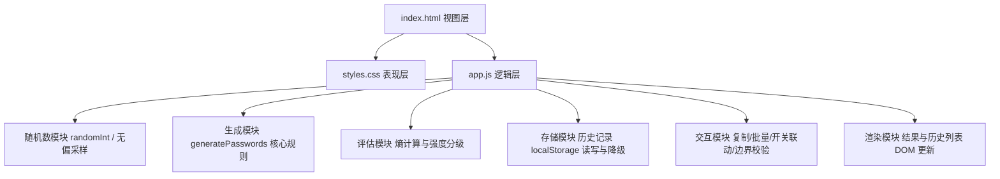

## 产品概述

将原 Python 命令行密码生成脚本改造为一个纯前端、零依赖、零构建的单页静态网站。用户打开页面即可在图形界面中生成随机密码，无需安装 Python、无需命令行交互，双击 HTML 文件或部署到任意静态托管即可使用。

## 核心功能

- **密码生成**：沿用原脚本内核规则——启用大写时随机生成 1~3 位大写字母，其余长度用「小写字母 + 数字」填充，最后整体打乱顺序；字符允许重复。
- **长度调节**：通过滑块与数字输入框设置密码长度，并实时显示当前值。
- **字符类型开关**：分别控制大写字母、小写字母、数字、特殊符号是否参与，各类型至少被保留一位；若用户试图关闭全部开关，界面自动阻止并给出提示。
- **一键复制**：点击复制按钮把结果写入剪贴板，并给出「已复制」的即时反馈。
- **批量生成**：一次生成多条密码并以列表呈现，支持逐条复制。
- **强度提示**：依据长度与字符池计算信息熵，用进度条与文字标签展示「弱 / 中 / 强 / 极强」。
- **历史记录**：自动记录最近生成过的密码，可一键复制或一键清空；数据仅保存在本地浏览器，不上传任何服务器。
- **异常与边界处理**：长度过短、长度非法、字符池为空等情况均有明确的界面提示，不会出现空白或卡死。

## 视觉与交互效果

深色科技感风格，深蓝黑背景带柔和光斑，主内容区为半透明玻璃质感面板，主行动按钮使用青紫渐变并在悬停时有光泽流动效果。密码以加大字号的等宽字体展示，生成与复制时带有轻微的高亮/缩放动效。整体为单列自上而下的卡片式布局，在手机与桌面端均自适应良好，键盘可完整操作，复制、清空等操作均有可见的状态反馈。

## 技术栈

- **页面结构**：原生 HTML5（单页 `index.html`）
- **样式**：原生 CSS3（CSS 变量、Grid/Flex、渐变、`backdrop-filter`、媒体查询），无预处理器
- **逻辑**：原生 JavaScript（ES6，普通 `<script src>` 引入，**不使用 ES Module**）
- **依赖**：无任何第三方库、无框架、无打包工具、**不引入任何 CDN 资源与外链字体**
- **随机源**：浏览器原生 `window.crypto.getRandomValues`，替代 Python 的 `random` 模块
- **持久化**：`localStorage`（带内存降级方案）

## 实现方式

### 总体策略

在当前空工作区中从零构建一个扁平化的静态站点，把原 Python 脚本的三段逻辑（生成大写、其余用小写+数字补齐、打乱顺序）直接映射为 JavaScript 函数，并把 CLI 的「输入长度 → 输出密码」循环升级为图形化配置面板。

**关键决策与理由：**

1. **不拆分 ES Module、不发起任何请求**：因为需要保证用户双击 `index.html` 通过 `file://` 协议打开也能正常渲染与运行。ES Module 与 `fetch` 在 `file://` 下会被浏览器 CORS 策略拦截，因此统一使用普通 `<script src="app.js">`，所有配置项以内联数据结构定义，不从外部加载任何文件。
2. **使用 `crypto.getRandomValues` 而非 `Math.random`**：`Math.random` 不具备密码学安全性且不同浏览器实现质量参差。为避免取模偏差（modulo bias），采用**拒绝采样**：按位宽计算可接受区间，丢弃落入尾部余数区间的样本后重取，保证每个候选字符等概率。
3. **保留原规则 + 泛化字符池**：默认状态下（大写/小写/数字开、符号关、长度 16）生成语义与原 Python 脚本一致；开启符号或关闭某类型时，规则泛化为「每个启用类型至少出现一次，大写类型出现次数为 1~3 位，其余长度从启用类型并集中随机填充，最后 Fisher-Yates 洗牌」。
4. **零构建直出仓库根目录**：静态文件直接放在仓库根目录，GitHub Pages 的 artifact 上传路径设为仓库根，避免引入任何构建步骤，也避免多一层目录带来的路径问题。

### 性能与可靠性

- 单次生成复杂度 O(length)；批量生成上限 50 条、长度上限 256，最坏约 1.3 万次随机取值，耗时在毫秒级，无需异步或分片。
- 历史记录上限 20 条且做去重，写入 localStorage 前做序列化异常捕获；`file://` 或隐私模式下 localStorage 不可用时自动降级为内存数组，功能不中断。
- 强度计算为 O(1)（熵 = 长度 × log2(字符池大小)），不引入逐字符扫描。
- 复制功能优先使用 `navigator.clipboard.writeText`，失败或不可用时回退到隐藏 `textarea` + `document.execCommand('copy')`，兼容 `file://` 场景。

### 执行注意事项

- **回退路径**：所有现代 API（`crypto.getRandomValues`、`navigator.clipboard`、`localStorage`、`backdrop-filter`）均需特性检测并给出降级实现，避免旧浏览器或受限环境下白屏。
- **无障碍**：密码结果区使用 `aria-live="polite"` 播报，开关使用原生 checkbox 并绑定 label，滑块设置 `aria-valuetext`，全部控件可 Tab 聚焦并有清晰焦点样式。
- **隐私**：历史记录与配置只存本地，页面不发起任何网络请求；清空历史有二次确认样式反馈。
- **零回归风险**：工作区为空目录，不涉及任何既有代码改动；不执行 `push` / `force-push` / 远端写操作，Git 仅做本地初始化与 remote 关联，首次推送方式在 README 中说明。
- **原 Python 源码处理**：归档到 `legacy/RandomPassword.py` 保留原始实现，便于对照与回查，不直接删除。

## 架构设计

页面为单页三层结构，职责清晰：



- **视图层（index.html）**：仅负责结构与语义标记，所有文案与控件预置在 HTML 中，不依赖脚本注入。
- **表现层（styles.css）**：以 CSS 变量集中管理色彩、圆角、阴影、动效时长，便于统一调整主题；响应式断点采用移动优先。
- **逻辑层（app.js）**：按上述六个内部模块用 IIFE + 函数划分，不使用模块系统；数据只通过 DOM 读取控件值，无全局污染（仅暴露必要的初始化调用）。

### 模块划分

1. **随机数模块**：`randomInt(maxExclusive)` 拒绝采样无偏整数、`pick/choices` 从字符串池取字符、`shuffle` 的 Fisher-Yates 实现。
2. **生成模块**：`generatePasswords(length, options, count)` 为核心出口，内部按启用类型构造保证位 + 填充位 + 洗牌。
3. **评估模块**：`calcEntropy(length, poolSize)` 与 `getStrengthLabel(bits)`。
4. **存储模块**：`loadHistory / saveHistory / clearHistory`，统一 try/catch 降级。
5. **交互模块**：事件绑定与联动（开关全关拦截、长度边界钳制、复制反馈、批量数量校验）。
6. **渲染模块**：密码主展示区、批量结果列表、历史列表、强度条的 DOM 更新与动效触发。

## 目录结构

```
RandomPassword/
├── index.html                       # [NEW] 单页应用骨架。包含顶部品牌栏、密码主展示区（密码文本、复制/重新生成按钮、强度条）、配置面板（长度滑块 + 数字输入、四个字符类型开关）、批量生成区（数量控件 + 结果列表）、历史记录区（列表 + 清空按钮）、页脚。设置语言、viewport、页面标题与 favicon（内联 data URI，避免外链）。用 aria-live 标记结果区，所有控件带可见 label。
├── styles.css                       # [NEW] 全站样式。文件头定义 :root CSS 变量（色彩、间距、圆角、阴影、过渡时长）；实现深色渐变背景与光斑装饰、玻璃拟态卡片、渐变主按钮与悬停光泽动效、等宽字体密码展示样式、强度条分段配色、结果/历史列表样式；提供 640px / 1024px 响应式断点与 prefers-reduced-motion 降级。
├── app.js                           # [NEW] 全部前端逻辑（普通脚本，非 module）。包含 randomInt 无偏随机、字符池常量与 generatePasswords 核心规则、熵与强度分级、历史记录存储与降级、复制回退方案、长度与开关的联动校验、DOM 渲染与事件绑定、页面初始化。所有现代 API 均做特性检测。
├── legacy/
│   └── RandomPassword.py            # [NEW] 归档原始 Python 实现，内容与上游仓库完全一致，仅供对照与溯源。
├── README.md                        # [MODIFY] 重写项目说明：项目简介、在线预览地址、核心功能列表、本地使用方式（直接双击 index.html 或用任意静态服务器）、生成规则说明（与原 Python 版的对应关系）、GitHub Pages 部署说明（Settings → Pages 将 Source 设为 GitHub Actions）、首次推送注意事项（本地仓库与上游历史无关联，需 --force 或 --allow-unrelated-histories）、目录说明、MIT 许可声明。
├── LICENSE                          # [NEW] MIT License，保留原仓库授权方式。
├── .gitignore                       # [NEW] 忽略操作系统与编辑器产生的临时文件（Thumbs.db、.DS_Store、.vscode/、.idea/），并保留 Python 归档可能产生的 __pycache__/ 忽略项。
├── .nojekyll                        # [NEW] 空文件，避免以 Jekyll 方式处理时忽略下划线开头的资源，兼作分支部署模式的保险。
└── .github/
    └── workflows/
        └── deploy.yml               # [NEW] GitHub Pages 部署流水线。触发条件为 push 到 main 及手动 workflow_dispatch；权限设置为 contents: read、pages: write、id-token: write；配置 concurrency 组避免并发发布；任务步骤依次为 actions/checkout、actions/configure-pages、actions/upload-pages-artifact（path 为仓库根目录）、actions/deploy-pages，并在 environment 中输出部署地址。
```

## 关键代码结构

以下为生成核心的对外契约，供实现时严格对齐（字符池规则与原 Python 脚本一致）：

```
字符池常量（与上游 Python 源码逐一对应）
  UPPER   = 'ABCDEFGHIJKLMNOPQRSTUVWXYZ'                        // 原 get_upper()
  LOWER   = 'abcdefghijklmnopqrstuvwxyz'                        // 原 get_lower() 中字母部分
  DIGITS  = '0123456789'                                        // 原 get_lower() 中数字部分
  SYMBOLS = '!@#$%^&*()-_=+[]{};:,.?/~'                         // 增强项，默认关闭

randomInt(maxExclusive: number): number
  // 返回 [0, maxExclusive) 内的均匀随机整数；maxExclusive <= 0 时抛出 RangeError
  // 使用 crypto.getRandomValues(Uint32Array(1)) + 拒绝采样消除取模偏差

generatePasswords(length: number, options: {upper, lower, digits, symbols}, count: number): string[]
  // 1. 汇总启用类型；若全部关闭则抛出可捕获的错误，由 UI 层拦截并提示
  // 2. 大写启用时取 randomInt(3) + 1 位大写；其余每个启用类型各保证至少 1 位（长度不足时自动降级为纯随机填充）
  // 3. 剩余长度从启用类型并集中随机取字符，允许重复
  // 4. Fisher-Yates 洗牌后返回；count 批量生成时逐条独立生成（不复用同一结果）
```

## 设计风格

采用「深空科技 + 玻璃拟态」的深色设计语言，营造安全、精密、现代的工具感。主内容区为半透明玻璃面板，背景为深蓝黑渐变并叠加柔和光斑，主行动按钮使用青紫渐变并带悬停光泽流动。整体克制、不喧宾夺主，视线自然聚焦于密码结果本身。

## 布局与页面区块（单页，自上而下）

1. **顶部品牌栏**：左侧渐变色盾形图标 + 标题「RandomPassword」，右侧放「清除历史」文字按钮与版本标识；窄屏下仅保留图标与标题。
2. **密码主展示区**：全宽玻璃卡片。上方为超大字号等宽密码文本（超出换行、可选中）；下方一行操作按钮：「生成」为主渐变按钮、「复制」为次级描边按钮；再下方为强度条（分段渐变填充）与熵值文字标签。复制成功时卡片边缘出现一次性青绿高亮描边。
3. **配置面板**：玻璃卡片，分两行。第一行为长度调节——数字输入框 + 滑块联动，右侧显示当前长度；第二行为四个字符类型开关，以可点击的小卡片形式呈现（图标 + 名称 + 简介），选中态为渐变描边与高亮背景，关闭全部开关时整体抖动并弹出提示。
4. **批量生成区**：数量步进控件（1~50）+「批量生成」按钮；结果以可滚动列表呈现，每行左侧等宽密码、右侧复制图标按钮，悬停行背景提亮。
5. **历史记录区**：最近 20 条记录列表，含密码、生成时间与复制按钮；右上角「清空」按钮带二次确认的微弱反馈；列表为空时显示占位说明文案。
6. **页脚**：浅色小字，包含项目说明、GitHub 仓库链接与「数据仅存于本地浏览器」的隐私声明。

## 交互与动效

- 生成、复制、批量生成均触发 150~250ms 的入场与高亮微动效；按钮悬停时渐变位移、按下时轻微下沉。
- 切换任意字符类型开关，密码展示区立即以淡出淡入方式刷新为新结果。
- 所有焦点元素具备清晰的渐变描边焦点环，支持完整键盘操作；遵循 `prefers-reduced-motion` 关闭非必要动画。

## 响应式

移动优先。窄屏（<640px）单列堆叠，滑块与输入框占满整行，开关改为两列网格，操作按钮等宽排列；桌面端（≥1024px）主内容限制最大宽度并居中，开关改为四列，批量列表与历史列表放宽行高与间距。

## Agent Extensions

### Skill

- **agent-browser**
- Purpose：在实现完成后，用浏览器自动化打开本地 `index.html`（`file://` 协议），验证页面渲染效果与核心交互链路是否正常。
- Expected outcome：成功加载页面并截图；确认密码可生成、长度滑块与类型开关联动生效、复制按钮给出反馈、批量生成与历史记录正常、关闭全部开关时被正确拦截、极端长度不报错，最终输出验证结论与截图作为交付证据。